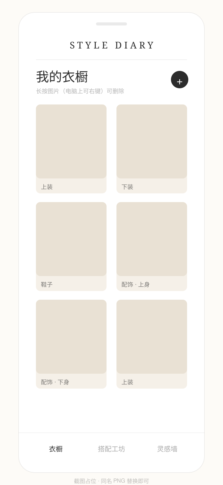
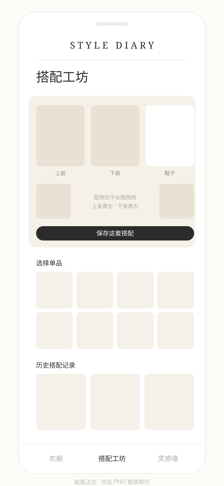
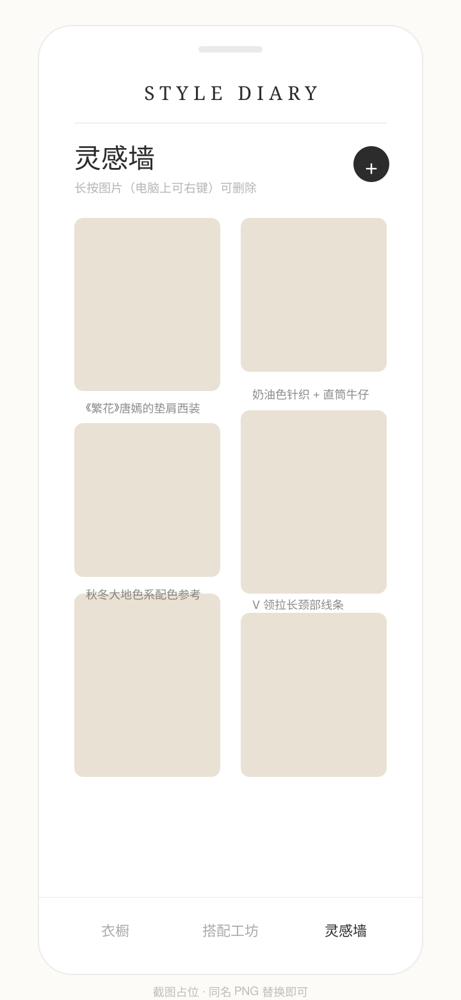
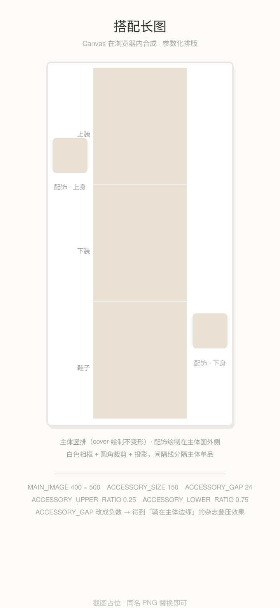

<div align="center">

# STYLE DIARY · 穿搭日记

**一个只给自己和朋友用的在线穿搭日记本**

拍照存单品 → 拼成一张杂志感的搭配长图 → 收集灵感参考

数据跟着账号走，不跟着设备走

[🌐 在线体验](https://peppy-starship-0a036b.netlify.app)　·　[📘 配置与维护手册](README-SETUP.md)　·　[🧭 已知取舍与限制](#八已知取舍与限制诚实清单)

`React 18`　`TypeScript`　`Vite`　`Tailwind CSS`　`Supabase · Postgres / Auth / Storage`　`Canvas`　`Netlify`

</div>

---

## 一、为什么做这个

起点是一个**只能在自己电脑上跑**的原型：数据存在浏览器 `localStorage`，用 `npm run dev` 打开。真用了一段时间后，暴露出 4 个痛点：

| # | 痛点 | 后果 |
| :-: | --- | --- |
| 1 | 换手机、清浏览器数据、重装系统 | 记录全没了 —— 数据绑在**设备**上，而不是绑在人身上 |
| 2 | 想给朋友看自己的搭配 | 得一直开着我的电脑，`localhost:5173` **不是网址** |
| 3 | 好不容易拼好的一套搭配 | 只能自己看，没有可交付、可分享的**产物** |
| 4 | 使用者不是程序员 | 配置与更新必须「照着文档就能做」，否则等于没交付 |

于是产品目标被压成三句话：

> **① 数据跟着账号走，不跟着设备走　② 有一个随时能打开的固定网址　③ 产出一个能直接看的长图**

## 二、界面

<p align="center">
  
  
  
</p>

<p align="center">
  
</p>

## 三、核心功能

| 模块 | 能力 | 几个刻意的设计 |
| --- | --- | --- |
| **衣橱** | 上传单品，分类为 上装 / 下装 / 鞋子 / 配饰（配饰再分上身、下身） | 上传即压缩后上云，数据库只存 URL，不存二进制 |
| **搭配工坊** | 3 个主体槽位 + 2 个配饰槽位 → Canvas 合成一张长图 → 保存 | 配饰**绘制在主体图外侧**不遮挡主体；约束「至少 2 件且必须含 1 件主体」；兼容更早的「只有记录没有图」的数据 |
| **灵感墙** | 双列瀑布流（交替长宽比）+ 文字备注 | 备注可以写「《繁花》唐嫣的垫肩西装」这类出处 |
| **账号** | 邮箱密码注册 / 登录，会话持久（关浏览器仍在线） | 开放注册：拿到网址的人自助开通，**账号之间数据硬隔离** |
| **删除** | 手机**长按 0.55s** / 电脑**右键** → 确认框 → 删记录 + 连带清理云端图片 | 删搭配**只删自己的长图**；成分布料照片属于单品记录，不受影响 |
| **旧数据迁移** | 检测浏览器遗留的旧数据 → 顶部横幅 → 一键导入云端（图片一起搬） | **全部成功才清本地**，有一条失败就保留，可再点一次重试 |
| **体验兜底** | 未配置环境变量时显示引导页而不是白屏；报错全部中文化 | 网络失败 / 登录过期 / 无权限 / 图片过大，都有一句人话 |

## 四、技术亮点

### 1. 多账号隔离：安全边界在数据库，不在密钥

前端只持有 Supabase 的 **anon / publishable key** —— 这个 key **设计上就是可公开的**，所以它不承担安全职责。真正的边界是：

- 三张表都启用 **RLS**：`using (auth.uid() = user_id)` + `with check (auth.uid() = user_id)`，行级读写都只能命中自己的数据；
- Storage 策略限定路径：`(storage.foldername(name))[1] = auth.uid()::text`，每个账号只能写入自己的 `{user_id}/` 目录。

因为这条边界在数据库层而**不是**「别泄露密钥」，所以我可以放心地**开放注册**——朋友拿到网址自助注册，互相看不到对方的任何记录。

### 2. 一个决策把「免费额度够不够」从风险变成够用

手机原图动辄 3~5MB，直接上传又慢又占额度。所以统一先压缩再上传：

```ts
const MAX_IMAGE_SIZE = 1600;  // 长边上限（px）
const JPEG_QUALITY = 0.85;    // 体积与画质的甜点位
```

体积**下降 90% 以上**，显示效果肉眼无差；按 200~400KB/张估算，**1GB 免费存储 ≈ 3000 张**。同时给存储桶加了护栏：**单文件 ≤ 5MB + 仅允许 `image/jpeg|png|webp`**，防止开放注册下共享额度被灌满。

### 3. 长图排版是「参数」，不是硬编码

所有版式参数集中在 `src/pages/OutfitWorkshopPage.tsx` 顶部（并同步记录在手册第十节）：

| 常量 | 值 | 作用 |
| --- | :-: | --- |
| `MAIN_IMAGE_WIDTH / HEIGHT` | 400 × 500 | 主体单品绘制尺寸，`cover` 方式居中裁剪**不变形** |
| `CANVAS_PADDING / BORDER` | 20 / 4 | 内边距与细边框 |
| `ACCESSORY_SIZE` | 150 | 配饰浮层大小（矩形裁剪 + 白色相框 + 投影） |
| `ACCESSORY_GAP` | 24 | 配饰与主体图的间隙。**改成负数**即得「骑在主体边缘」的杂志叠压效果，且不会越出画布 |
| `ACCESSORY_UPPER / LOWER_RATIO` | 0.25 / 0.75 | 上身配饰靠左上、下身配饰靠右下 |

画布宽度是**按需预留**的：有上身配饰才在左侧加一条配饰列宽，有下身配饰才在右侧加——没有配饰时不会白白多出空白。

### 4. 长按 / 右键手势：4 个必须处理的边界

删图片是低频但高危的操作，用常显的小叉子会破坏画面，所以统一成隐藏手势（`src/hooks/useLongPress.ts`，复用三处）。真正麻烦的是边界：

1. **双触发去重** —— Android 长按会同时触发 pointer 计时器和原生 `contextmenu`，用 700ms 时间戳窗口去重，避免一次长按弹两个确认框；
2. **不干扰滚动** —— 手指位移超过 12px 立即取消计时，页面滚动完全不受影响；
3. **吞掉抬手 click** —— 长按触发后返回一次「本次点击应被忽略」，否则抬手会顺手打开大图灯箱；
4. **阻止原生弹层** —— `preventDefault()` 掉 `contextmenu`，否则移动端「存储图像」菜单会盖住我们自己的确认框。

外加 `navigator.vibrate(15)` 震动反馈（iOS 静默忽略），以及 `-webkit-touch-callout / user-select: none` 防止长按选中文字。

### 5. 静默失败治理：一次真实踩坑带来的三层修复

**现象**：删除记录后，Supabase 存储桶里的图片还在。**而且没有任何报错** —— 接口返回 200，`data` 是空数组，界面显示删除成功。

**根因**：Storage 的 `delete` 接口内部**要先 select 到目标对象的元数据**才会动手。只给 delete 策略、没给 `storage.objects` 的 `select` 策略时，它一个都不删、也不报错。

**修复分三层，我认为这是这个项目里最有价值的一段代码**：

1. **根因** —— `supabase/schema.sql` 补上 select 策略（并注明「这一条务必保留」，因为缺了会静默失效）；
2. **可观测性** —— `src/lib/imageStorage.ts` 检测「返回空数组」这一特征，打一条自解释的警告：

   ```ts
   if (!data || data.length === 0) {
     console.warn('图片没有被云端删除（Storage 可能缺少 select 策略，重跑 supabase/schema.sql 可修复）：', path);
   }
   ```

3. **文档** —— 写进手册 FAQ，并说明历史孤儿图片要在 Storage 界面删，**不要用 SQL 删 `storage.objects`** 的行（官方说明那只删元数据，文件依旧占额度）。

> 学到的一条经验：**静默失败是最坏的失败形态**——它比报错危险，因为它会让人相信一切正常。所以凡是「成功」的路径，都要反向验证一次结果真的发生了。

### 6. 旧数据迁移：幂等、可重试、不在用户数据上做不可逆操作

老版本的数据还留在浏览器里（`style-diary-clothing` / `style-diary-outfits` / `style-diary-inspirations` 等键）。迁移逻辑的取舍是**保守优先**：

- 图片压缩后上传、记录逐条写库，**逐条 try/catch**：单条失败只计入 `failed`，不中断其余；
- **全部成功才清除本地数据**；只要有一条失败就保留本地数据，用户可再点一次重试；
- 已经是云端 URL 的图片原样复用，不再重复上传。

### 7. 上线自检：把「我看着正常」变成「用户看着正常」

第一次上线后，我自己浏览器打开一切正常，但**无痕窗口打开是一个 401 登录跳转页**。原因是托管平台存在**账号级**的默认配置（站点被设为「仅团队成员可访问」），而我的浏览器带着登录态，完全看不出来。

修复之后，我把「**必须用无痕窗口 / 手机流量打开自检**」写进了上线检查清单，与其它三项并列。同样的教训还有一条：**更新线上时不要再去拖一次 `dist` 文件夹**（那会新建站点、得到新网址，老网址原地不动，极容易误判成"已更新"）。

## 五、架构

```
浏览器（React SPA · 移动端优先）
   │
   ├── 认证 ──► Supabase Auth（邮箱 + 密码，会话持久化）
   │
   ├── 数据 ──► Postgres × 3 表
   │              clothing / outfits / inspirations
   │              RLS: auth.uid() = user_id   ← 多账号隔离的唯一防线
   │
   └── 图片 ──► Storage 桶 style-diary
                  路径约定 {user_id}/{随机名}.jpg
                  桶级护栏：public · 单文件 ≤5MB · jpeg|png|webp

托管：Netlify（静态站点 · 一键发布 · 可回退到任意历史版本）
```

## 六、快速开始

```bash
npm install          # 安装依赖
npm run dev          # 启动，浏览器打开 http://localhost:5173/
```

首次运行前需要两件事（**详细图文步骤见 [配置与维护手册](README-SETUP.md) 第三节**）：

1. 在项目根目录创建 `.env.local`（已被 `.gitignore` 的 `*.local` 排除，不会进仓库）——复制仓库里的 **`.env.example`** 模板最快：

   ```bash
   Copy-Item .env.example .env.local        # macOS / Linux：cp .env.example .env.local
   ```

   ```ini
   VITE_SUPABASE_URL=https://xxxxxxxx.supabase.co
   VITE_SUPABASE_ANON_KEY=在这里粘贴 anon / publishable key
   ```

2. 打开 Supabase 控制台 → SQL Editor → 把 **`supabase/schema.sql`** 全文粘贴执行一次（脚本可重复执行，不会重复建表）。

其他常用命令：

```bash
npm run typecheck    # 类型检查（当前 0 错误）
npm run build        # 打包到 dist/（产物约 336 KB）
npm run preview      # 本地预览打包结果
npm run lint         # ESLint
```

## 七、部署与日常发布

线上是 **Netlify 静态站点**。日常改完代码，在项目根目录跑**一条命令**即可（网址保持不变）：

```powershell
powershell -ExecutionPolicy Bypass -File .\update-online.ps1
```

它做两件事：`npm run build` → `npx netlify-cli deploy --prod --no-build --dir=dist`。

| 特性 | 说明 |
| --- | --- |
| 失败安全 | 任一环节失败**立刻中止**，线上仍是上一个正常版本，不会变坏 |
| 耗时 | 实测构建约 5 秒 + 上传上线约 20 秒 |
| 可回退 | Netlify 保留每次 deploy，出问题可一键回退到任意历史版本 |
| 换电脑恢复 | `npm install` → `npx netlify-cli login` → `npx netlify-cli link --id <站点ID>` |

> 长期维护也可以走 **Vercel + GitHub 自动部署**（`git push` 即上线），两种方式可并存，步骤见手册 6.2 / 6.4。

## 八、已知取舍与限制（诚实清单）

| 事项 | 现状与取舍 |
| --- | --- |
| **图片桶是 public** | 有意的取舍：省掉签名 URL 的复杂度与流量开销。缓解方式是文件名含随机串、目录不可列举。风险面是「拿到完整图片链接的人能看图」，若面向更大规模会换成 **private bucket + 签名 URL** |
| **忘记密码没有自助入口** | 界面未提供找回入口。出路：配自定义 SMTP 后启用重置邮件，或用管理接口改密码。这也是我下一步最想补的缺口 |
| **免费额度是共享的** | 所有注册账号共享 1GB 存储 / 500MB 数据库；已用「压缩 + 桶级护栏」把风险控制在可接受范围 |
| **读取是一次性全量** | 现在是一次 `select *` 拉全量并按时间倒序。数据量小的时候最简单；规模上来后应先做分页 + 索引优化 |
| **没有自动化测试** | 目前靠 `tsc --noEmit`（0 错误）+ 手工验收。优先想补的是 **RLS 越权用例**（用 A 账号读写 B 的数据必须失败），因为它验证的是安全边界 |
| **免费域名与休眠** | `*.netlify.app` 在部分地区可能偏慢或受干扰；免费项目长期无访问会被暂停（数据不丢，控制台唤醒即可） |
| **单品名称未充分利用** | 已采集并入库，但衣橱列表当前只显示分类标签，名称的价值还没释放 |

## 九、项目结构

```
src/
├── pages/
│   ├── LoginPage.tsx            登录 / 注册
│   ├── WardrobePage.tsx         衣橱
│   ├── OutfitWorkshopPage.tsx   搭配工坊（含 Canvas 长图合成）
│   └── InspirationWallPage.tsx  灵感墙
├── components/
│   ├── ImageUpload.tsx          上传（压缩 → 上传云端 → 返回网址）
│   ├── Modal.tsx
│   ├── BottomNavigation.tsx
│   └── LegacyMigrationBanner.tsx 提示把旧本地数据导入云端
├── contexts/AuthContext.tsx     登录状态管理
├── hooks/
│   ├── useCloudData.ts          云端读写（一套通用 Hook 支撑三张表）
│   └── useLongPress.ts          长按 / 右键手势（删除入口）
├── lib/
│   ├── supabase.ts              Supabase 客户端
│   ├── imageStorage.ts          图片压缩、上传、删除
│   ├── migrateLocalData.ts      旧本地数据迁移
│   ├── authErrors.ts            报错信息中文化
│   └── id.ts                    记录 id 生成
├── constants/categories.ts      分类与槽位定义
└── types/index.ts               数据类型

supabase/schema.sql              建表 + RLS + 存储桶策略（可重复执行）
docs/screenshots/                首屏截图
public/                          站点图标与社交预览图（favicon.svg / og-cover.png）
README-SETUP.md                  配置与维护手册（370 行）
update-online.ps1                一条命令更新线上版本
```

## 十、文档

- **[README-SETUP.md](README-SETUP.md)** —— 配置与维护手册，10 个章节：结构总览 / 本地运行 / Supabase 配置 / 日常使用 / 换设备 / 部署到公网 / 必须知道的限制 / 常见问题 / 代码地图 / 长图排版参数。
  它面向**非技术使用者**编写，目标是「照着做就能跑起来、出问题能找到答案」——我把这份文档当成产品交付物的一部分，而不是附属品。

---

## English Summary

**STYLE DIARY** is a mobile-first personal outfit diary: photograph your clothing into a wardrobe, compose outfits into a magazine-style long image on a `<canvas>`, and collect inspiration images — with all data bound to an email account instead of a device.

- **Stack**: React 18 · TypeScript · Vite · Tailwind CSS · Supabase (Postgres / Auth / Storage) · Canvas · Netlify — running at **zero cost**.
- **Multi-account isolation** is enforced at the database (RLS `auth.uid() = user_id` + per-user storage folders), not by hiding keys — which is what makes self-service sign-up safe.
- **Image pipeline**: everything is downscaled to a 1600px long edge / JPEG q0.85 (>90% smaller), with a 5MB + image-only guardrail on the bucket, keeping the free 1GB tier sufficient (~3,000 photos).
- **Ship & operate**: one command builds and publishes to production in ~25s, never corrupting the live version on failure; deploys are rollback-able; a 370-line manual lets a non-technical user configure and maintain it.

> Personal project — no license attached yet; the code is shared for reference and portfolio purposes.

